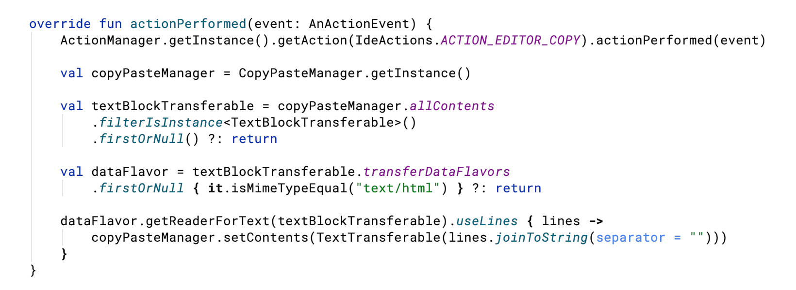

# Copy as HTML

JetBrains IDEs platform plugin that copies selection, including syntax highlighting, formatting, font and background, 
as plain text containing inline-styled HTML markup.

For when you want to embed **your** code as **you** see it, not as some random dumb syntax highlighter will colorize it.

It copies selection as both `text/plain` and `text/html`, so you can paste the same clipboard content in plain text editor, 
like your blog editor, and in places that support rich text pasting, like Google Slides, Keynote or MS Word.

In Markdown, it only works when HTML blocks are supported **and** `style` attributes are not ignored.
So it won't work in GitHub Flavored Markdown files, but will work in eg. Medium or Ghost blog posts.

So this code...



... becomes this plain text in your clipboard:

> ```<html><head><meta http-equiv="content-type" content="text/html; charset=UTF-8"></head><body><pre style="background-color:#212121;color:#f5f5f5;font-family:'Roboto Mono';font-size:9.8pt;"><span style="color:#e91e63;">override&#32;fun&#32;</span><span style="color:#8bc34a;">actionPerformed</span>(<span style="color:#ff9800;">event</span>:&#32;<span style="color:#00bcd4;">AnActionEvent</span>)&#32;{<br>&#32;&#32;&#32;&#32;<span style="color:#00bcd4;">ActionManager</span>.getInstance().getAction(<span style="color:#ff5722;">IdeActions</span>.<span style="color:#9575cd;font-style:italic;">ACTION_EDITOR_COPY</span>).actionPerformed(<span style="color:#ff9800;">event</span>)<br><br>&#32;&#32;&#32;&#32;<span style="color:#e91e63;">val&#32;</span>copyPasteManager&#32;<span style="color:#e91e63;">=&#32;</span><span style="color:#00bcd4;">CopyPasteManager</span>.getInstance()<br><br>&#32;&#32;&#32;&#32;<span style="color:#e91e63;">val&#32;</span>textBlockTransferable&#32;<span style="color:#e91e63;">=&#32;</span>copyPasteManager.<span style="color:#9575cd;font-style:italic;">allContents<br></span><span style="color:#9575cd;font-style:italic;">&#32;&#32;&#32;&#32;&#32;&#32;&#32;&#32;</span>.<span style="font-style:italic;">filterIsInstance</span><span style="color:#e91e63;">&lt;</span><span style="color:#00bcd4;">TextBlockTransferable</span><span style="color:#e91e63;">&gt;</span>()<br>&#32;&#32;&#32;&#32;&#32;&#32;&#32;&#32;.<span style="font-style:italic;">firstOrNull</span>()&#32;<span style="color:#e91e63;">?</span>:&#32;<span style="color:#e91e63;">return<br></span><span style="color:#e91e63;"><br></span><span style="color:#e91e63;">&#32;&#32;&#32;&#32;val&#32;</span>dataFlavor&#32;<span style="color:#e91e63;">=&#32;</span>textBlockTransferable.<span style="color:#9575cd;font-style:italic;">transferDataFlavors<br></span><span style="color:#9575cd;font-style:italic;">&#32;&#32;&#32;&#32;&#32;&#32;&#32;&#32;</span>.<span style="font-style:italic;">firstOrNull&#32;</span><span style="font-weight:bold;">{&#32;it</span>.isMimeTypeEqual(<span style="color:#fff176;">"text/html"</span>)&#32;<span style="font-weight:bold;">}&#32;</span><span style="color:#e91e63;">?</span>:&#32;<span style="color:#e91e63;">return<br></span><span style="color:#e91e63;"><br></span><span style="color:#e91e63;">&#32;&#32;&#32;&#32;</span>dataFlavor.getReaderForText(textBlockTransferable).<span style="font-style:italic;">useLines&#32;</span><span style="font-weight:bold;">{&#32;</span><span style="color:#ff9800;">lines&#32;</span><span style="font-weight:bold;">-&gt;<br></span><span style="font-weight:bold;">&#32;&#32;&#32;&#32;&#32;&#32;&#32;&#32;</span>copyPasteManager.setContents(<span style="color:#00bcd4;">TextTransferable</span>(<span style="color:#ff9800;">lines</span>.<span style="font-style:italic;">joinToString</span>(<span style="color:#03a9f4;">separator&#32;=&#32;</span><span style="color:#fff176;">""</span>)))<br>&#32;&#32;&#32;&#32;<span style="font-weight:bold;">}<br></span>}</pre></body></html>```

## Usage

After installing, when editor has selection the `Copy as HTML` action will be available in Edit and popup menu with shortcut of `Shift+Cmd+H` (or `Shift+Ctrl+H` on Windows and Linux).

## License

This project is licensed under the MIT License. See the [LICENSE](LICENSE) file for details.
